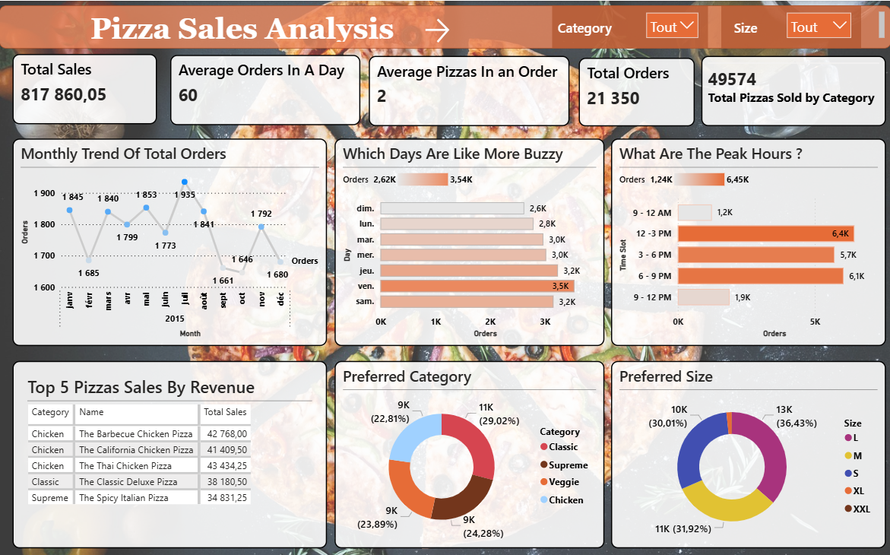
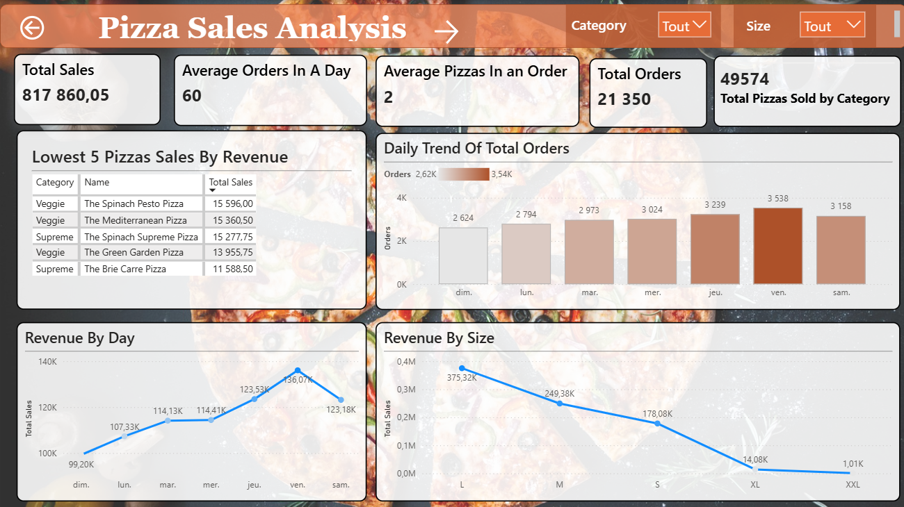
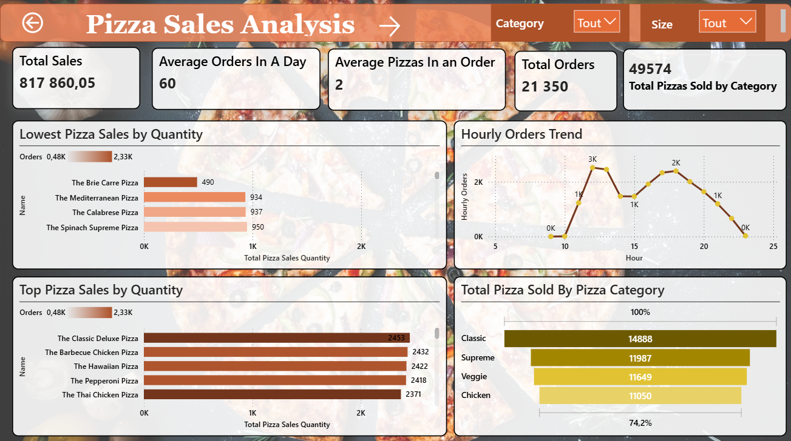
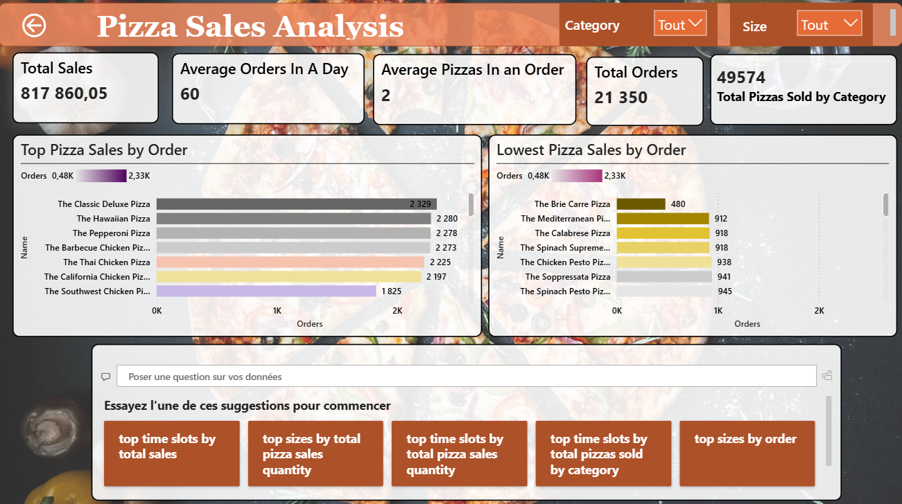

# Power BI Dashboards

A collection of interactive **Power BI dashboards** analyzing sales performance and customer behavior.  

---
## Key Insights
- Total sales & monthly order trends
- Top 5 pizzas by revenue
- Busiest days & peak hours
- Preferred categories and sizes

## 📂 Files
- [Download Pizza Sales Dashboard (.pbix)](https://drive.google.com/file/d/1oq-KqyLrZfmwucO19C1tK9V6fI28as2h/view?usp=drive_link)
  
## Pizza Sales Analysis

### Overview

### Daily Trends

### Sales by Quantity & Category

### Orders Analysis

## Tools used
- Power BI
- Data Cleaning (Power Query)
- DAX for KPIs & measures
  
