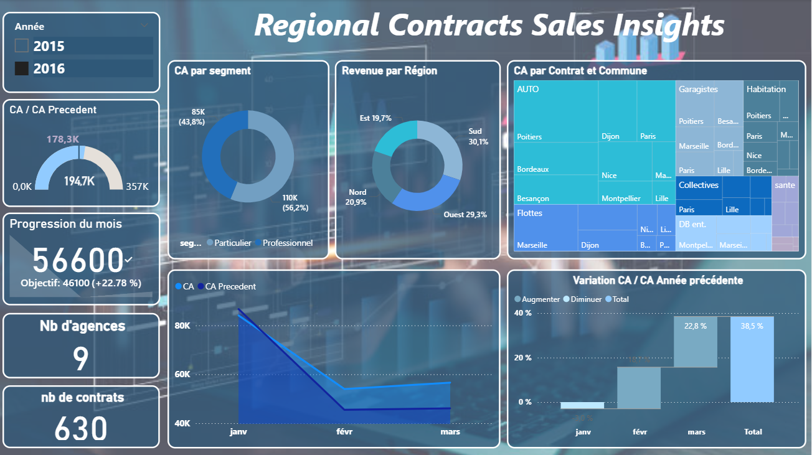

# Power BI Dashboards

A collection of interactive **Power BI dashboards** analyzing sales performance and customer behavior.  

---
## Key Insights
- Total sales & monthly order trends
- Top 5 pizzas by revenue
- Busiest days & peak hours
- Preferred categories and sizes

## 📂 Files
- [Download Pizza Sales Dashboard (.pbix)](https://drive.google.com/file/d/1oq-KqyLrZfmwucO19C1tK9V6fI28as2h/view?usp=drive_link)
  
## Pizza Sales Analysis

### Overview

### Daily Trends

### Sales by Quantity & Category

### Orders Analysis

## Tools used
- Power BI
- Data Cleaning (Power Query)
- DAX for KPIs & measures

---

## 📊 Regional Contracts Sales Insights  

A Power BI dashboard offering **regional insights** into **sales performance, contracts, and agency activities** across several **European countries**.  

**Main insights:**  
- Revenue by region and customer segment  
- Monthly progress vs targets  
- Agencies and contracts overview  
- Year-over-year revenue variation  

📁 **File:** [`Agency_Contracts.pbix`](files/Agency_Contracts.pbix)  
🖼️ **Overview:**  

